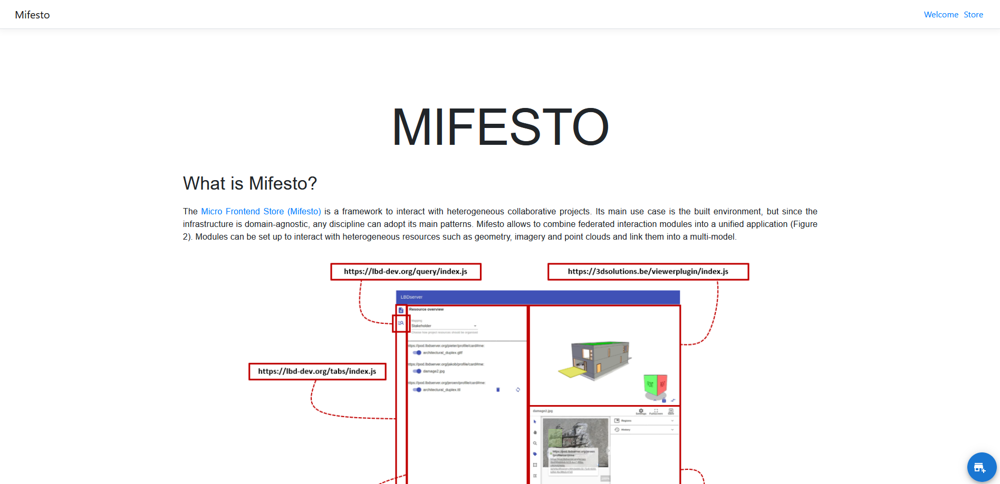

# Mifesto: Welcome Page
This is a micro-frontend module that provides a Welcome page with information about the Mifesto ecosystem. It is the default landing page of the [Bundler prototype](https://github.com/AECOstore/bundler), integrated in the [Welcome Configuration](https://raw.githubusercontent.com/AECOstore/RESOURCES/main/configurations/welcome.ttl) along with the [Store Page](https://github.com/AECOstore/store-page). The page does not contain any interaction functionality.

## About Mifesto
Mifesto (Micro-Frontend Store) is an experimental framework for federation of micro-frontends. It is a work in progress and is not yet ready for production use. Micro-frontend modules expose the following: 

* a manifest file that describes the module and its dependencies
* loadable code which may be injected into a "bundler" application

The bundler application is responsible for loading the micro-frontend modules and providing a framework for them to interact with each other. The bundler application is also responsible for providing an interface for the micro-frontend modules to render into. Mifesto modules may or may not be compatible with the [ConSolid ecosystem](https://content.iospress.com/articles/semantic-web/sw233396), or generally with AEC multi-models. To be useful for interacting with multi-models, a minimal functionality is required. This functionality is described in the [Mifesto documentation]().